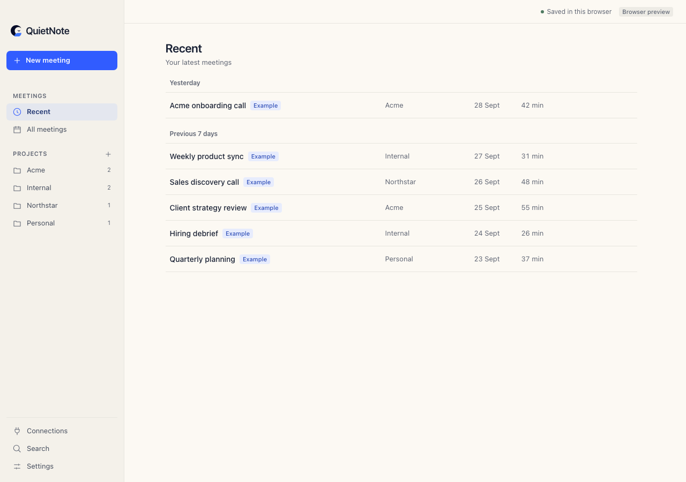

# QuietNote

A calm, local-first meeting workspace built **on Scratch by Eric Li**, not a replacement editor built from scratch. Meetings are the primary object. On macOS and Windows, QuietNote records your microphone and the call audio when you press start, and transcribes it on the device with a bundled Whisper model, removing filler words like "um" and "uh" while keeping the original words. There are no bots, AI summaries, cloud sync or accounts. The only network use is an explicit send of action items to a Linear or GitHub account you connected.



## Run

Requires Node 22+ and npm. The desktop app additionally needs Rust and the platform prerequisites for Tauri 2.

```sh
npm ci
npm run dev          # browser preview at http://localhost:1420
npm run tauri dev    # real desktop filesystem + native shell
npm run tauri build  # platform desktop bundle
```

`npm run tauri dev` and `npm run tauri build` first run `npm run models`, which downloads the speech models (about 575 MB, checked against pinned SHA-256 hashes) into `src-tauri/resources/models/`. This happens once, at build time; the app itself downloads nothing. Building the recorder needs CMake (and LLVM/clang on Windows) for whisper.cpp. The macOS app requires macOS 14.6 or later.

A verified macOS development bundle is produced at `src-tauri/target/debug/bundle/macos/QuietNote.app`. It is a local development build, not a signed/notarized distribution release.

For this implementation session, Rust was installed only under `/private/tmp/quietnote-cargo` and `/private/tmp/quietnote-rustup`, without modifying the global PATH. Until those temporary directories are cleared, native commands can be run as:

```sh
CARGO_HOME=/private/tmp/quietnote-cargo \
RUSTUP_HOME=/private/tmp/quietnote-rustup \
PATH=/private/tmp/quietnote-cargo/bin:$PATH npm run tauri dev
```

## What works

- **First launch** is a single screen: create your first project, or explore six example meetings (badged *Example*). New archives start empty; nothing is seeded without asking.
- **Projects** are created in one step (a name) and map to folders in the archive. **New meeting** asks only for an optional title and a project, then opens the meeting.
- **Library**: Recent, All meetings and per-project views. Rows show title, project, date and duration, grouped as Today / Yesterday / Previous 7 days / month. Status appears only while something is happening or needs attention (Recording, Transcribing, Needs attention).
- **Meeting workspace**: sticky title and tabs for Summary, Decisions, Action items, Notes and Transcript. Summary previews up to three decisions and links to open action items. Decisions and action items can be added inline (`Owner — task` sets an owner). Tasks stay Markdown checkboxes.
- **Notes** use Scratch's **actual TipTap Editor**, with formatting, Markdown source, slash commands, tables, code, math and find.
- **Recording** (macOS and Windows): *Start recording* on a meeting opens a small recorder with the elapsed time and whether the mic and the call audio are coming through. The microphone and the system audio (what the computer plays, so the other people on the call) are written as two 16 kHz WAV tracks in the meeting's `audio/` folder. System audio comes from a Core Audio tap on macOS ("System Audio Recording" permission, no screen recording) and WASAPI loopback on Windows. Nothing joins the call. Before the first recording, the recorder explains both macOS permissions and waits for Start, so the explanation comes before the system prompts; a denied microphone shows what failed with *Open System Settings* and *Try again*. While recording, every view shows a recording bar (title, elapsed time, Stop), and the menu bar / system tray shows the same meeting, "Started … by you · No bot joined", the elapsed time and *Stop recording*; the recorder can be hidden. The tray's *Start recording…* opens New meeting; recording starts only from its button, and only one meeting records at a time. If a device disappears or stops delivering audio (unplugged headset, AirPods switching away), QuietNote says so ("Microphone disconnected", "Microphone changed to …") and reconnects to the current default device; audio already captured is kept. A silent track after 20 seconds shows a hint (usually a permission). Quitting from the tray while recording reads *Stop recording and quit*.
- **Local transcription**: when recording stops, the meeting shows *Transcribing on this Mac… 42%*. whisper.cpp runs the bundled Whisper large-v3-turbo model with voice activity detection, on Metal on Apple silicon and the CPU on Windows. Mic speech is labelled *You* and system audio *Others*; the mic's echo of the call is dropped. If it fails, the meeting says why, the audio is kept (never deleted on failure), and *Try again* retries. A missing or damaged model is reported before recording and checked by SHA-256 before transcribing; there is never a fallback transcript.
- **Filler words**: like Wispr Flow, QuietNote keeps what was said and shows a cleaned version. Unlike Wispr it runs no LLM and sends nothing anywhere: cleanup is delete-only and rule-based. It removes "um", "uh", "erm", "hmm" and stutters ("I I I think", "we should we should"), fixes the punctuation and capitalization this leaves, and keeps words whose meaning depends on context ("like", "you know", "I mean", "actually"). It never merges self-corrections, because in a meeting that could be two people. The Transcript tab switches between *Clean* and *Verbatim*. The browser preview (and Linux) keep a prototype capture that records nothing.
- **Search** (Cmd/Ctrl+K) covers titles, summaries, decisions, action items, notes and transcripts. Results show context with the match highlighted and open the meeting on the tab where the match was found. Enter opens the first result.
- **Connections** (sidebar) is a searchable directory of services. Linear and GitHub work today: paste a personal key, which QuietNote checks with the service and keeps in the macOS Keychain, then use *Send to…* on a meeting's Action items to create issues. Only each item's text and owner, plus the meeting's title, date and project, are sent. The issue link is written back onto the action item's Markdown line. Example meetings can't be sent. Every other service (Zoom, Google Meet, Teams, calendars, Jira, Asana, Todoist, Things, Reminders, Gmail, Slack, Notion, Obsidian, Google Docs) is listed as *Planned* and does nothing. The browser preview can't connect.
- **How Connections differ from cloud assistants.** Assistants like Grok connect services through cloud OAuth: after one sign-in their servers can reach your data on demand, and custom connectors must be public MCP servers. QuietNote does the opposite. Keys stay in your Mac's Keychain, requests go from your Mac only when you press Send, and there is no QuietNote server. Planned sign-in connectors (Google, Microsoft, Slack, Notion) would use native-app OAuth (system browser, PKCE, loopback redirect) with tokens kept on the Mac. Meeting-platform entries never join a call; they would only notice a call locally and offer to start capture.
- **Privacy** separates *Active now* (facts that are true today, plus the enforced *Confirm before capture*, *Remove filler words* and *Delete audio after transcribing* switches) from *Planned* preferences, which are saved but have no effect. Cloud processing is unavailable.
- **Local archive** settings: Open archive, Reload from disk, and an Advanced section with the path, the Markdown workspace and example meetings.
- **Recovery**: per-keystroke drafts, serialized writes and native close handling. A failed save shows "Your latest changes haven't been saved to disk" with Retry and Reload saved version. Drafts from a previous session are offered back as *Save now* or *Discard*. Files changed outside QuietNote raise an explicit Refresh prompt; QuietNote's own saves don't. A recording cut short by a crash is recovered from its audio (the WAV files are checkpointed every second): the next launch shows a *Recovered recording* banner and a notice in the meeting saying what was saved and whether the transcript was recovered or failed (with the audio kept). If transcription itself crashes QuietNote twice, the meeting waits for the user instead of retrying at every launch. One with no audio reopens as *Needs attention* with Add notes and Mark as ended.
- **Returning**: QuietNote reopens the last view, meeting and tab.
- **Keyboard**: Cmd/Ctrl+N new meeting; Cmd/Ctrl+K (or P, or Shift+F) search; Cmd/Ctrl+, settings; Cmd/Ctrl+\\ or Cmd/Ctrl+Shift+Enter hide the sidebar; Cmd/Ctrl+Shift+M Markdown source in the editor; Esc closes dialogs; arrow keys move between meeting tabs. Cmd/Ctrl+K inside the editor still inserts a link.
- **Narrow windows**: below 720px the sidebar becomes an icon rail with project initials; no horizontal scrolling.

## Reused from Scratch

The Tauri 2 desktop shell, React/Vite foundation, Rust filesystem commands, folder operations, file watcher, Tantivy search with fallback, TipTap editor and Markdown serialization, theme provider, formatting and keyboard tools remain in place. The retained generic workspace is available from **Settings → Local archive → Open Markdown workspace** on desktop (`?workspace=markdown`). Return through its Settings → About → Return to QuietNote meetings. Standalone Markdown file previews still use the upstream preview route.

The full pre-change audit is in [docs/SCRATCH-AUDIT.md](docs/SCRATCH-AUDIT.md). Original source files remain unless replaced by working QuietNote equivalents. AI-provider tools, Git tools and generic note operations remain secondary in that advanced workspace; QuietNote does not automatically invoke them.

## What changed

The new shell lives in `src/quietnote/`. Default navigation is New meeting, Recent, All meetings, Projects, Search and Settings. Notes are one meeting tab. Projects are top-level archive folders. The new `src-tauri/src/meetings.rs` module lists projects, creates project folders and meeting bundles, reads them and persists metadata/preferences; Markdown edits reuse Scratch's file service. The interaction rationale is in [docs/UX-AUDIT.md](docs/UX-AUDIT.md).

Warm paper, navy, cobalt and mint tokens match the existing QuietNote landing page. The QuietNote logo replaces Scratch's icon and sidebar mark; App/window/package metadata and visible legacy workspace branding are updated. Scratch's automatic update feed is disconnected; draft-release automation is manual and uses QuietNote naming. No release was published.

## File model and location

Desktop source of truth:

```text
<platform app data>/app.quietnote.desktop/meetings/
  .initialized                    # written by earlier builds only
  .privacy.json
  .scratch/settings.json          # retained Scratch settings compatibility
  Acme/
    2026-09-28-acme-onboarding/
      metadata.json
      meeting.md
      transcript.md               # cleaned (or verbatim) turns, rendered from transcript.json
      transcript.json             # recorded meetings: raw recognized words + filler deletions
      audio/mic.wav               # recorded meetings: your microphone, 16 kHz mono
      audio/system.wav            # recorded meetings: the call audio
  Northstar/...
  Internal/...
  Personal/...
```

The exact platform path is shown in Settings. On macOS it is:

```text
~/Library/Application Support/app.quietnote.desktop/meetings/
```

On Windows/Linux, Tauri resolves the platform app-data directory. The separate QuietNote identifier isolates this archive from an existing Scratch installation.

`meeting.md` contains title/date/project/duration, Summary, Decisions, Action items and a final Notes section. Notes consumes the remainder of the file, so headings inside manual notes are preserved. Tasks use `- [ ]` / `- [x]`. Transcript text lives **only** in `transcript.md` (and, for recorded meetings, its raw source `transcript.json`, which keeps every recognized word with the byte ranges cleanup removes). Turns are `### mm:ss Speaker`, with *You* for the microphone and *Others* for the call audio. Metadata has `id`, `title`, `date`, duration in **seconds**, project, participants, status (`idle | recording | processing | ready | error`), capture timestamps, the audio folder (`<Project>/<id>/audio`, or null), relative transcript/meeting paths and tags. The preview's simulated capture holds only its measured duration; no audio file is fabricated.

New archives start empty. Example meetings are written only when you choose *Explore example meetings* (first launch) or *Add examples* (Settings → Local archive → Advanced), and existing meeting directories are never overwritten. Archives created by earlier builds keep their demo meetings, which are recognised and badged Example. Metadata and preferences use atomic file replacement; Markdown writes use the retained Scratch direct-file save command. These are separate files, not a transactional database. On desktop, a meeting left in `recording` with audio is recovered (WAV headers repaired, duration taken from the audio) and transcribed, one left in `processing` is transcribed again, and one without audio becomes `error` (*Needs attention*). In the browser preview, such a meeting shows as *Needs attention* until you choose *Mark as ended*. Nothing is resumed or fabricated.

Browser preview is explicitly labeled and uses `localStorage`, not desktop files. Recovery drafts also use local webview storage until committed to the archive. Browser data is specific to its origin; it does not automatically migrate into the desktop app. Corrupt or unavailable archives produce a visible error instead of silently resetting data. External file changes are loaded using the refresh button; concurrent editing in another application does not have conflict merging.

## Boundaries

All demo transcripts and summaries are authored examples. A new meeting's Summary, Decisions and Action items stay empty until you add something; the UI says *No summary yet* rather than inventing content. There are no AI summaries, no cloud processing and no retention engine; *Keep meeting data* is a planned preference that stores intent only. Speakers are *You* and *Others*: there's no diarization between the other participants. Filler removal is English and rule-based, so it leaves context-dependent fillers ("like", "you know") in place. The browser preview and Linux keep the prototype capture, which records nothing. Windows builds but hasn't been run: see [docs/WINDOWS.md](docs/WINDOWS.md). Real-device checks are in [docs/QA-RECORDING.md](docs/QA-RECORDING.md) and measurements in [docs/PERFORMANCE.md](docs/PERFORMANCE.md). No calendar, CRM, payments, authentication or collaboration systems were added. Connections are limited to user-initiated Linear and GitHub issue creation with personal keys; there is no OAuth, background sync or inbound data.

## Checks and screenshots

```sh
npm run lint       # new shell, browser tests and tooling; upstream had no ESLint setup
npm run typecheck  # entire existing and new frontend
npm test           # Playwright interaction/persistence and Markdown-model tests
npm run build
cargo test --manifest-path src-tauri/Cargo.toml
# Run the bundled model on a folder with mic.wav and/or system.wav (16 kHz mono):
QUIETNOTE_TEST_AUDIO=/path/to/audio cargo test --release --manifest-path src-tauri/Cargo.toml transcribes -- --ignored --nocapture
npm run tauri build -- --debug --bundles app  # macOS development bundle
```

Install a Playwright Chromium browser with `npx playwright install chromium` if one is not already cached. Tests use fresh browser contexts and do not modify the real desktop archive. Native tests write isolated temporary bundles.

[Validation results](docs/VALIDATION.md) include the actual checks performed. [Screenshot gallery](docs/SCREENSHOTS.md) links library, summary, active capture, privacy, manual notes and transcript views. Browser screenshots deliberately retain their preview/prototype labels. [Exact file manifest](docs/MODIFIED-FILES.md) lists every tracked modification and added file relative to upstream, excluding ignored dependencies and build outputs.

## License and attribution

Scratch is by Eric Li and contributors, declared MIT in its upstream README. The audited checkout did not include a separate LICENSE file. Its README is preserved verbatim in [docs/UPSTREAM-README.md](docs/UPSTREAM-README.md); [LICENSE](LICENSE) provides the MIT text and explicit upstream attribution, and [NOTICE](NOTICE) documents provenance. Attribution is visible in both QuietNote privacy settings and the retained Markdown workspace's About screen. No original license/copyright file was removed.
